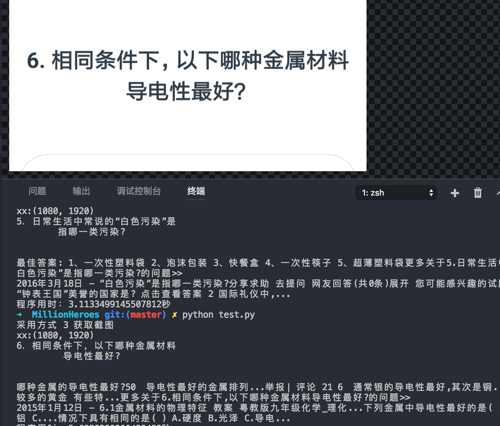
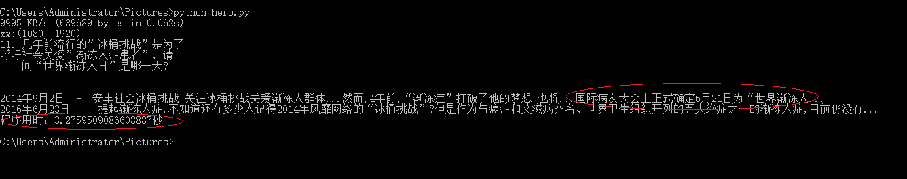

# [西瓜视频]百万英雄/芝士超人/冲顶大会答题助手
## 游戏模式

>  答对12题，每题10秒，全答对瓜分百万奖金

## 效果示意图
### macOS

### Windows

## 原理说明

1. 参考微信跳一跳助手，使用adb上传手机截图

2. 把问题区域裁剪出来后用汉王的[ocr识别](https://market.aliyun.com/products/57124001/cmapi011523.html?spm=5176.730005.0.0.B1mZNd#sku=yuncode552300000)出文本

3. 然后调用百度搜索（把搜索到的前两个答案显示在屏幕）

> 整个程序运行完估计5~8秒左右，还可以有时间答题!强烈建议多人配合操作！！

# Todo
1. 有一个思路 就是把问题的选项答案也给识别出来，然后把百度搜出来的答案匹配选项答案，如果有答案直接一个模拟点击。
2. 优化百度的搜索，对题目进行分类，如小程序头脑王者题目，历史、文艺、流行等类别进行相关搜索，提高效率。

