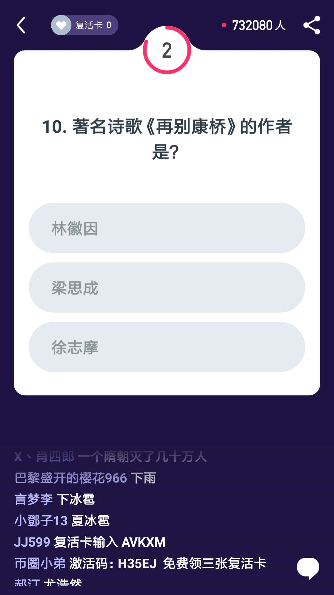
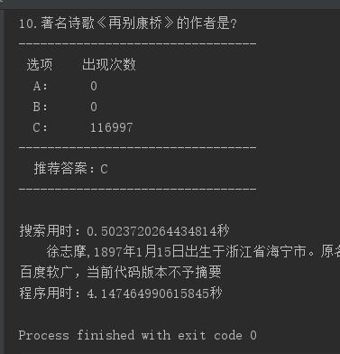

# [西瓜视频]百万英雄/芝士超人/冲顶大会答题助手
最近百万英雄/芝士超人/冲顶大会等直播答题非常火，特别是23人平分百万奖金的新闻引爆2018热点，受到微信跳一跳的启发，通过把问题区域裁剪出来后用百度的ocr识别出文本，然后调用百度搜索来显示参考答案，提升答题吃鸡率。

**欢迎大家PR新的代码和优化。**

## 更新日志
- 2018.01.14
  - 加回screen_check提高兼容性，windows/mac都下ok
- 2018.01.13
  - 增加简易多线程
- 2018.01.12
  - 增加百度OCR、词频统计

## 使用教程

1. 安装ADB 驱动，可以到[这里下载](https://adb.clockworkmod.com/) 
安装 ADB 后，请在环境变量里将 adb 的安装路径保存到 PATH 变量里，确保 adb 命令可以被识别到
  
2. 安装所需python依赖库，在命令行输入:

    pip install -r requirements.txt

3. 在default.json里填写自己百度ocr的APPid 
百度ocr：http://ai.baidu.com/tech/ocr/general

4. 连接手机确保开启开发者模式（目前仅支持安卓手机）

## 效果图

## 大家有时间的话可以试试把它弄成全自动的

有一个思路 就是把问题的选项答案也给识别出来，然后把百度搜出来的答案匹配选项答案，如果有答案直接一个模拟点击.

# 交流学习（微信群）

